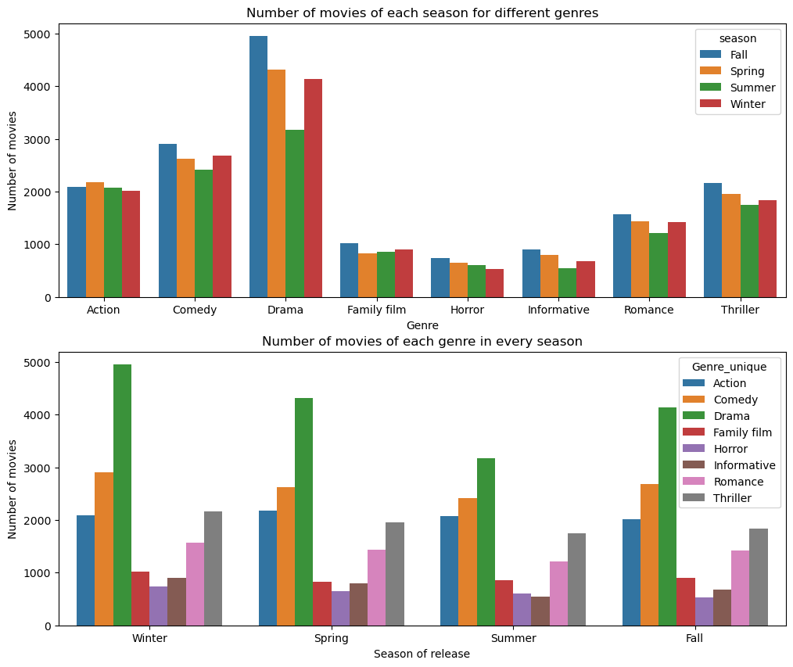

We will present our Data story in this folder .
Hope you will **like** it

#  And if we were in a time loop ?


<!-- Timeloop -->


## Abstract : 
What if we were stuck in a time loop? This is the question we try to answer throughout this study. We conduct a temporal analysis of movies’ characteristics throughout the years and the months, focusing on the identification of patterns repeating over and over again in cinematographic history.  We aim to recognize a potential influence of the release date of a movie on its type, its plot and its success. To achieve this goal, we focus our interest on the main genres of the films, their recurring characters, the grossing profit they bring and their plot summaries. We hope that we’ll manage to give you insights on the hidden mechanisms of the cinema industry!


### Petite image pour tester 


<!-- Description de l'image -->



### et une deuxieme parce que ca commence a me souler


# ADA Template Website
## Usage
1. Fork (copy) this repository by clicking the "Fork" button on the top right corner.
2. Go to "Settings" -> "Pages" in your forked repository. Under "Branch" change "None" to "master" and click "Save".
3. Edit the `_config.yml` file in your forked repository to change the site title (after `title:`) and description (after `description:`).
4. Build your own page by editing this `README.md` (home page) and creating new `.md` files (other pages), formatting is done with standard [GitHub Markdown syntax](https://docs.github.com/en/get-started/writing-on-github/getting-started-with-writing-and-formatting-on-github/basic-writing-and-formatting-syntax), we provide an example file `example.md` in the repository.
**Important**: Please include ```--- layout: default ---``` (the first three line in `example.md`) at the beginning of your every newly created `.md` file.
5. Add your new `.md` files to the site by editing the `_config.yml` file in your forked repository. Under `navigation:` add a new pair of `- title:` and `url:`, and fill their value with your page name and `.md` file name. Remember to remove the `- title:` and `url:` pair for the example page.
6. Go back to "Settings" -> "Pages" to find your website link.


<iframe src="distrib_over_season_combined.html" width="800" height="600"></iframe>
