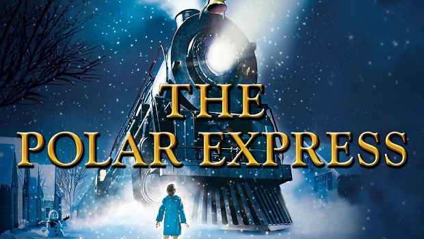

As the holiday season begins, the need to get cozy and watch a comforting sentimental Christmas movie suddenly appears. There is, by chance, a new Christmas movie at the box office which looks perfectly cheesy!

Mmh… do you also feel this lingering sense of déjà vu? The Christmas movie, last year, had almost the same poster, and the same type of actors were starring. 
But when you think more deeply, you also realize that two months ago, you absolutely wanted to get in a spooky mood, and watch the scariest movie, as well as last October and all the years before!

{:width="500px" class="center-image"}

You might have just found out the most disturbing observation: maybe it is not just a personal feeling, maybe most movies in each season share the same features. 
The evolution of an industry is always seen through its yearly graduation, but striking results could appear if time evolution was considered as a cycle. 
Most importantly, tendencies of the movie industry give insights about our whole society, as it is a mirror of our state of mind.
You are then just about to find out that our mood is stuck in a time loop, which controls our entertainment desires! 

But as you are not into conspiracy theories, you might not be that easily convinced…
This study is then here to give you proper answers to your intuition. 
The tools of data sciences learned in ADA will be of great use to deepen the following lines of research: 
Is there a statistically significant recurrence of specific film genres during particular seasons or months of the year? 
Are there discernible patterns in the box office performance of specific film genres throughout the year, and do these patterns correlate with particular months?
Is there a relation between the connotation of the words and the season of release?
Can we predict the release season of a movie by looking at its main features?

In a first part the main genres will be extracted from the data, and their tendency over months will be highlighted.
In a second part, a causal analysis will be performed to explore links between a movie success and its release season. 
Then, using machine learning tools, we will determine if it is possible to predict the season of release of a movie, given its main features.

## I. Are there redundancies over months?

This question will be answered through the spectrum of genre and box office revenue. The goal is to determine if there are significant peaks in certain months for specific genres, and also to get an overview of the monthly box office revenue distribution.
### 1. The monthly distribution of genres
There are over 351 different genres in the movie metadata, which seems difficult to study at first sight! But their occurrence decays as a power law, which means that taking into account only the first genres will still describe most of the data. Moreover, many genres have slightly different names but can be grouped in main ones.
8 main genres are then chosen, because they define a high proportion of data, and also because they are the ones which will be relevant further in our monthly study:
- Drama
- Comedy
- Romance
- Thriller
- Action
- Family film
- Horror
- Informative

Let’s look at the overall monthly distribution of these main genres.

<iframe src="distrib_over_season_combined1.html" width="1000" height="400"></iframe>
<iframe src="distrib_over_season_combined2.html" width="1000" height="400"></iframe>

The first histogram displays genre distribution over month. 
It is clear that most of the genres have less movies in summer than in other seasons, except for Action, Horror and Family film movies.
The second plot allows us to compare genres throughout the months.
There are indeed more informative movies than horror movies in Spring but the tendency is the opposite in Summer.
It seems clear Drama, Comedy, and Action genres are the most present, and this for all seasons.
No striking results appear in this first plot, it would be too easy right? 
Maybe some tendencies will appear by looking at genres individually…
We indeed found 3 genres with noticeable peaks: Horror, Family, and Romance movies.

<iframe src="combined_plots_horror.html" width="1000" height="380"></iframe>

<iframe src="combined_plots_romance.html" width="1000" height="380"></iframe>

<iframe src="combined_plots_Family film.html" width="1000" height="380"></iframe>

As can be seen in these plots, the spooky season is clearly during October, while family movies are more released during holidays periods (July, November, December), and a small peak can be seen in February for Romance movies.
However, these results need to be nuanced by stronger analysis, like hypothesis testing. For each of these three genres, a null hypothesis is built, to test the validity of the peaks seen in the previous plots:
H0: "Mean of movies per year and per month for peak months == Mean of movies per year and per month for all the other months."

<iframe src="ttest.html" width="1000" height="380" class="center-iframe"></iframe>

The null hypothesis is rejected under the significance level of 0.05 for the Horror movies in October, and for the Family films in July, November, and December, but not for the Romance movies in February.
This means that it is most likely that there will be more Horror movies in October, while there will be more Family films in July, November and December. 
Our time loop seems to be verified for some main genres!

## II. Is the box office affected by a particular release season for a particular movie genre?

We concluded previously that for some genres, there was a clear seasonal redundancy in terms of number of movies released. 
If it is true that for some genres, the number of movies increases a lot during a certain month, then does it mean that the movies released during this particular period are more successful in terms of box office revenue? In other words, will a Horror movie be more successful if released in October? 
This question goes even further than only looking at the movie redundancies, it asks the question of economic success, which can be very interesting for the cinema industry…

Because we obtained significant results only for Horror and Family movies, let’s perform a causal analysis on these genres. This observational study aims to determine if the economic success of Horror/Family movies is caused by a release month in October/July, November, December.
### 1. Hunt down the confounders!

There is a need to balance our control and treatment groups, so that the comparison of their mean box office revenue makes sense. 

The first main confounder would be the movie budget.  Indeed, box office is influenced by when the big franchise movies are released. We’re interested in the success of movies regardless of how big the franchise is.

Secondly, an important bias is the continent of release. In fact, Halloween is celebrated at different degrees of popularity. For example, Russian people don't even celebrate it, whereas It is a big event in the USA. For the case of Family movies, the holiday season also clearly depends on the country of release.
For that reason we might want to match movies with the same continent of release. 

Finally, we take into account the release year of the movie, to eliminate the influence of inflation over the years.

Let's visualize the distribution of these confounders:

<iframe src="box_Horror_before.html" width="1000" height="380" class="center-iframe"></iframe>

<iframe src="box_Family_before.html" width="1000" height="380" class="center-iframe"></iframe>

To balance these confounders, a propensity score is used to match the datasets, while an exact matching is performed on the country of release.

### 2. Contradictory results

<iframe src="barplot.html" width="1000" height="380" class="center-iframe"></iframe>

* Horror movies

Regarding Horror movies, it was found that after matching, the movies released in October (treatment group) were showing better average box office revenue than in other months. 

* Family movies

Regarding Family movies, it was found that after matching, the movies released in July/November/December (treatment group) were showing lower average box office revenue than in other months. 

We can then conclude that the reason why there are more Horror movies in October is because they are more successful during this month. But regarding Family films, economic success cannot explain why there are more of these movies in July, November, December. 

It seems the movie productors relied on common sense, i.e. that families go more often to the cinema during holidays. But they can never be sure that their prediction will be successful. For example, they did not take into account high competition during these time periods. 
Our dataset consists of movies from previous years, where Data Science was not such a topic… It would be then interesting to look at the same features but for only recent movies. Unfortunately, our dataset does not contain enough new movies to deepen this analysis. 

## III. Is a movie release season predictable?

Well well well… We’ve already identified some remarkable patterns occurring year after year, but you want more right ? Since you’ve been nice this year (we hope), we got you an early christmas gift… thank us later ! 

Our goal now is to generalize these few significant peaks to a model able to predict the release season of a movie from its characteristics (plot, genres…). To do so, we had to go through many steps but nothing could stop us from trying to make  you smile in these hard times. 

### 1. Processing the plot summaries (part I)

To have the chance to use the plot summaries in our analysis, we first had to process all these texts and make them interpretable to a machine learning algorithm. To achieve this, we transformed all the plots into a bag-of-words matrix (called BOW from now on). Each row represents a film and each column represents a word. But we were feeling quite picky this year, so we added some conditions on the words to be kept in our BOW. Since our ultimate goal was to orient the model towards the right release season of the movies, we thought it would be smarter and more efficient to only focus on the temporality-related words that we carefully gathered within one lexicon. To stay general enough, we expanded this lexicon with the synonyms of all the words originally chosen. 

We now have a temporality-orientated BOW only containing the words we are interested in (and their synonyms). After performing an L1 normalization on the rows of the BOW, we finally obtain the first usable features of our final model. 

### 2. Processing the plot summaries (part II)

Even after doing this, we still felt like the summaries had more to tell about the release season of the films. Therefore we decided to conduct a sentiment analysis on the whole text (without selecting only the words from our lexicon). This gave us four more features to work with : negative, positive, neutral and compound. 

### 3. Processing the metadata features 

For the two genre columns, called genre 1 and genre 2, we performed one-hot encoding. We thus ended up with 16 columns, two per each of the 8 genres. After doing this, all our features are ready for use and we can finally move on to choosing the best model. 

### 4. Choosing the right model and hyperparameters 

After quite some work, it is finally time to dive deep into the machine learning process itself, and to pick the optimal combination of the model and its parameters. To do so, we conducted a k-fold cross-validation process on three different types of model : Boosted decision trees, logistic regression and random forest. These three methods work in quite a different way and are optimal in different scenarios, so we thought we would find the gem within them. The cross validation is achieved by trying different values of the learning rate for Boosted trees, different values of C (Expliquer ce que c’est…)  for the Logistic regression and different numbers of classifiers (Expliquer ce que c’est..) for Random forest. These are the results we obtained :

<iframe src="playing_with_C_testSampleSize.html" width="1000" height="380" class="center-iframe"></iframe>

It appears that the logistic regression with c=0.1 is the combination resulting in the best accuracy, which we aim to optimize. 

### 5. Optimizing the model 

To find the most efficient model, we first trained two different sets of features separately, before combining them. The first set of features was constituted of the metadata features combined with the ones extracted from the sentiment analysis. The second one was the BOW. We performed a feature selection process, which consisted in training the model with different combinations of features to keep only the most relevant ones. We concluded that the system was more efficient when it only took into account the genres and the sentiment analysis features. For the model solely based on the BOW, the feature selection was done through the use of the lexicon. The two models trained separately both reached an accuracy close to 27.5%. We then decided to merge all these features to get the best of both worlds. This led us to the following results, summed up in the confusion matrix : 

<iframe src="confusion_matrix.html" width="1000" height="380" class="center-iframe"></iframe>

Outstanding isn'it ? 
Wait… you don’t look very excited about these results. You are hard to convince aren’t you? That’s not a problem for us, just give us some time…

### 6. Significance level 

Ok… we have to admit that such a confusion matrix is not going to revolutionize the cinema industry, and we understand the disappointment, but is our model that irrelevant ? Let’s take a closer look at the significance level of this classifier.

Our goal with this predictor is, if not to become mediums,to try to make a difference compared to a randomly made decision. Let’s see what values of accuracy would make a statistically significant difference at the 5% significance level. 

<iframe src="p_values_vs_accuracy.html" width="1000" height="380" class="center-iframe"></iframe>

Now the tension is building… have we managed to reach this level ? Are you ready to discover the final accuracy of our model ? Should we unveil it ? 

<iframe src="decompte.html" width="200" height="200" class="center-iframe"></iframe>

We have an accuracy of … !!!!!!! Therefore our model is significantly better than a random predictor, which means that it helps predict the release season of a movie, even if it can’t always be right. But in reality, who is ?

## IV. Conclusion 

So, are we really in a time loop? 
What seemed very intuitive at first feels suddenly more complex…
Initially, we were on good tracks to make this huge discovery. Indeed, for some genres, we found a monthly loop pattern. 
Then, we found some of these loops are exploited and maintained by the cinema industry e.g. horror movies in October. But we also found some others are not, they might be the consequence of traditional cycles e.g. holidays for family films.

