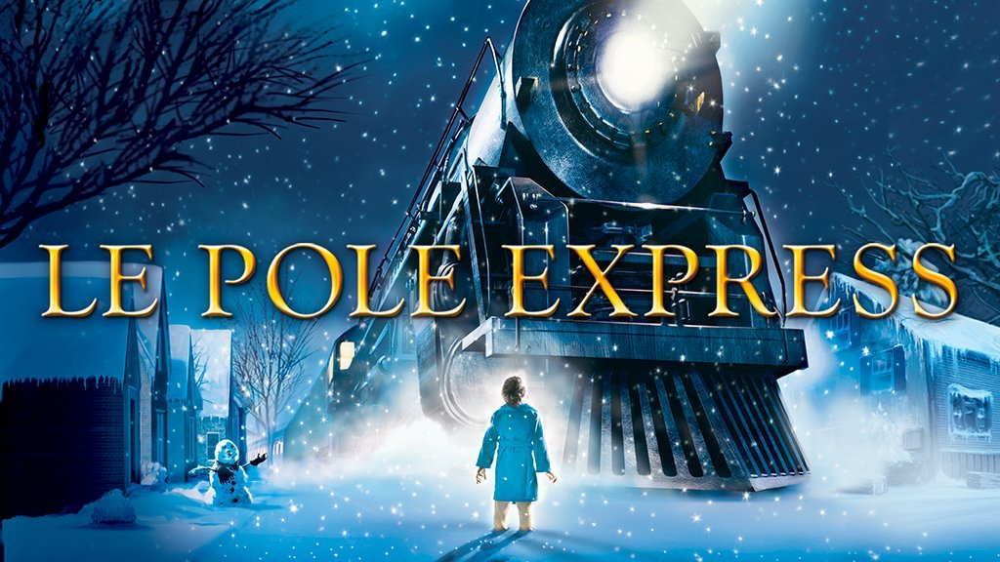

#  And if we were in a time loop ?

As the holiday season begins, the need to get cozy and watch a comforting sentimental Christmas movie suddenly appears. There is by chance a new Christmas movie at the box office which looks perfectly cheesy!

Mmh… do you also feel this lingering sense of déjà vu? The Christmas movie last year had almost the same poster, and the same type of actors were starring. 
But when you think more deeply, you also realize that two months ago, you absolutely wanted to get in a spooky mood, and watch the scariest movie, as well as last October and all the years before!

{:width="500px" class="center-image"}

You might have just found out the most disturbing observation: maybe it is not just a personal feeling, maybe most movies in each season share the same features. 
The evolution of an industry is always seen through its yearly graduation, but striking results could appear if time evolution was considered as a cycle. 
Most importantly, tendencies of the movie industry give insights about our whole society, as it is a mirror of our state of mind.
You are then just about to find that our mood is stuck in a time loop, which controls our entertainment desires! 

But as you are not into conspiracy theories, you might not be that easily convinced…
This study is then here to give you proper answers to your intuition. 
The tools of data sciences learned in ADA will be of great use to deepen the following lines of research: 
Is there a statistically significant recurrence of specific film genres during particular seasons or months of the year? 
Are there discernible patterns in the box office performance of specific film genres throughout the year, and do these patterns correlate with particular months?
Is there a relation between the connotation of the words and the season of release?
Can we predict the release season of a movie by looking at its main features?

In a first part the main genres will be extracted from the data, and their tendency over months will be enhanced. (plots of the main genres over months, analysis of pics, and importance of years. T-test to validate the hypothesis)
In a second part, a causal analysis will find if the reason why movies of a certain genre are more successful in terms of revenue is due to the fact that they are released during their season of predilection. (Très mal expliqué, mais faire causal analysis pour horror et family)
Then, using machine learning tools, the final goal is to determine if it is possible to predict the season of release of a movie, given its main features.

## Are there redundancies over months? 

This question will be answered through the spectrum of genre and box office revenue. The goal is to determine if there are significant peaks in certain months for specific genres, and also to get an overview of the monthly box office revenue distribution.
### The monthly distribution of genres
There are over 351 different genres in the movie metadata, which seems difficult to study at first sight! But their occurrence decays as a power law, which means that taking into account only the first genres will still describe most of the data. Moreover, many genres have slightly different names but can be grouped in main ones.
8 main genres are then chosen, because they define a high proportion of data, and also because they are the ones which will be relevant further in our monthly study:
- Drama
- Comedy
- Romance
- Thriller
- Action
- Family film
- Horror
- Informative
Let’s look at the overall monthly distribution of these main genres.

<iframe src="distrib_over_season_combined.html" width="800" height="850"></iframe>

The first histogram lets us compare each genre with itself for every month. 
It is clear that most of the genres have less movies in summer than in other seasons, except for Action, Horror and Family film movies.
On the second plot, it is easier to compare each genre to other genres throughout the months.
There are indeed more informative movies than horror movies in Spring but the tendency is the opposite in Summer.
It seems clear the Drama, Comedy, and Action genres are the most present, and this for all seasons.
No striking results appear in this first plot, it would be too easy right? 
Maybe some tendencies will appear by looking at genres individually…
We indeed found 3 genres with noticeable peaks: Horror, Family, and Romance movies.

<iframe src="combined_plots_horror.html" width="1200" height="500" class="center-iframe"></iframe>

    <iframe src="combined_plots_romance.html" width="1200" height="500"></iframe>

    <iframe src="combined_plots_family.html" width="600" height="400"></iframe>

