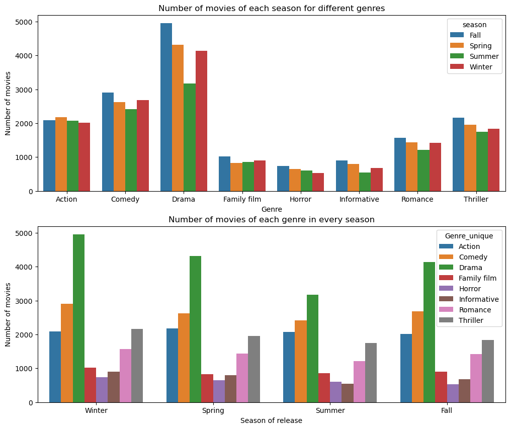

We will present our Data story in this folder .
Hope you will **like** it

#  And if we were in a time loop ?

## Abstract : 
What if we were stuck in a time loop? This is the question we try to answer throughout this study. We conduct a temporal analysis of movies’ characteristics throughout the years and the months, focusing on the identification of patterns repeating over and over again in cinematographic history.  We aim to recognize a potential influence of the release date of a movie on its type, its plot and its success. To achieve this goal, we focus our interest on the main genres of the films, their recurring characters, the grossing profit they bring and their plot summaries. We hope that we’ll manage to give you insights on the hidden mechanisms of the cinema industry!

### Petite image pour tester 

<!-- Description de l'image -->

### et une deuxieme parce que ca commence a me souler

